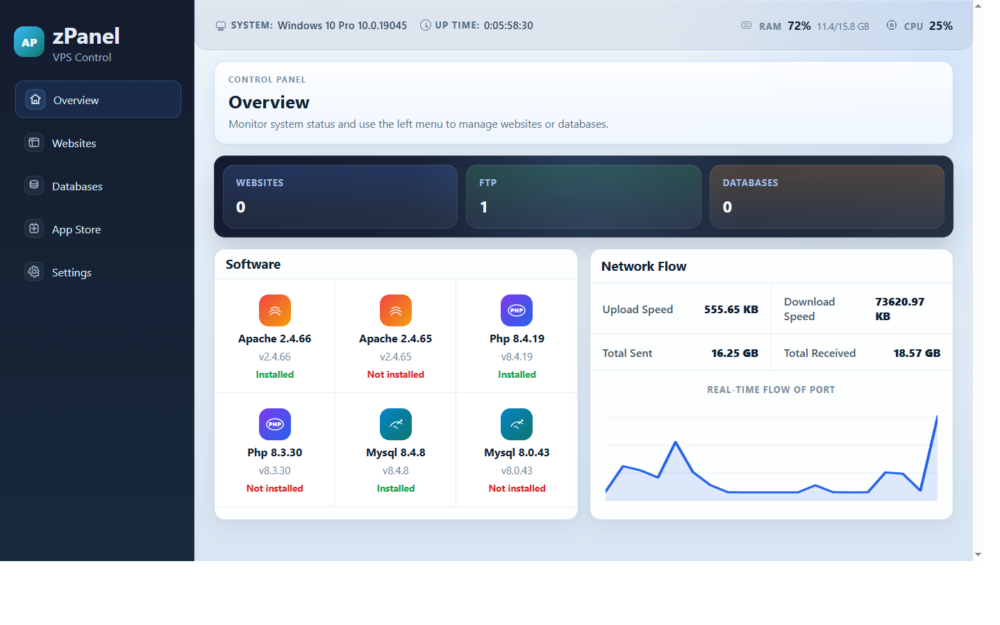

<div align="center">
  
</div>

# zPanel (WAMP Stack Manager)

**zPanel** is a next-generation, fully portable WAMP (Windows, Apache, MySQL, PHP) stack manager for Windows. Designed with an elegant, modern GUI, it enables developers to seamlessly install, manage, and monitor their local web development environments with ease.

## 📖 About ZPanel

Setting up a local web server environment shouldn't require complex configurations or bloated software. **zPanel** is built on top of Go to provide a blazing-fast, lightweight, and single-executable solution. It completely eliminates friction by handling the downloading and configuration of portable runtimes (Apache/MySQL/PHP), enabling you to immediately focus on building apps.

### Highlights:
- 🚀 **Zero Installation**: Download, double click, and you're running.
- 🌐 **Clean & Intuitive GUI**: A sleek modern web-based dashboard.
- 🛠 **Automated Configuration**: zPanel handles internal configuration paths automatically.
- 🔌 **Dynamic Routing**: Instant web proxy mapping to local folders.

## ✨ Features

- **Portable Runtime**: Downloads and configures portable versions of Apache, MySQL, and PHP.
- **Service Management**: Easily start, stop, and restart web services.
- **Website Management**: Create and manage local websites with automatic proxy configuration.
- **Database Management**: Support for SQLite and portable MySQL.
- **System Monitoring**: Real-time CPU, RAM, and network usage tracking.
- **Single Instance**: Ensures only one instance of the panel is running.
- **GUI & API**: Control everything through a web-based dashboard or directly via the API.

## Installation

1. Download the latest `zpanel.exe`.
2. Place it in a directory where you want your data to be stored.
3. Run the executable. It will create a `data` directory and a `config.toml` file.

## Configuration

The application can be configured via `config.toml`:

```toml
port = 8080         # Port for the web dashboard (default: 8080)
base_dir = "./data" # Directory to store data and runtimes
max_memory_mb = 512 # Default memory limit (placeholder)
log_level = "warn"  # Logging level (info, warn, error)
```

## Development

### Prerequisites

- [Go](https://go.dev/dl/) 1.26+
- [Git](https://git-scm.com/downloads)

### Building from Source

To build the project, run:

```bat
build.bat
```

Optional arguments:

```bat
build.bat -output custom-name.exe -version 0.1.1
```

This will:
1. Compile the Go source code with the GUI flag.
2. Embed the application icon.
3. Output `zpanel.exe` in the root directory.

## Architecture

- **Backend**: Go with `http.ServeMux`, `gopsutil`, and `modernc.org/sqlite` (CGO-free).
- **Frontend**: Vanilla HTML/JS/CSS embedded in the Go binary.
- **Storage**: SQLite for internal state and portable runtimes for services.

## Security Note

By default, the panel binds to `127.0.0.1`. It is intended for local development and should not be exposed to the public internet without additional security layers (e.g., a reverse proxy with authentication).

## License

MIT License
